```{r setup, include=FALSE}
knitr::opts_chunk$set(echo = TRUE)
```

### Wprowadzenie (czêœæ I)

Celem tej czêœci jest sprawdzenie mocy testów normalnoœci dla mieszanki dwóch rozk³adów normalnych.  
**Hipoteza**: Podejrzewam, ¿e wraz ze wzrostem œrednich i odchyleñ standardowych (bez ró¿nicy, którego rozk³adu), zwiêksza siê moc testu. Wykresy s¹ wtedy od siebie bardziej oddalone (w przypadku zmiany wartoœci œredniej) lub wartoœci roz³o¿one s¹ na wiêkszej powierzchni (zmiana odchylenia standardowego). Na pewno moc roœnie, jeœli zwiêkszamy liczbê obserwacji - przy wiêkszych iloœciach ³atwiej zaobserwowaæ odstêpstwa od normy. Co do prawdopodobieñstwa, jego wykres mo¿e mieæ kszta³t paraboli wygiêtej ku górze - w przypadku skrajnych prawdopodobieñstw trudniej zauwa¿yæ odstêpstwo od rozk³adu normalnego, bo œladowe s¹ iloœci danych z drugiego rozk³adu.   
**Dane**: Rozwa¿am dane o d³ugoœci od 10 do 200. Liczbê symulacji ustawi³em na 10. W skrypcie u¿ywa³em liczby 1000, ale gdy przysz³o do kompilowania wszystkiego naraz, mój komputer nie da³ rady. Aby jednak lepiej zobrazowaæ zale¿noœci, nie bêdê wyœwietla³ wykresów utworzonych na podstawie widocznego poni¿ej kodu, lecz wstawiê obrazy przygotowane jeden po drugim w skrypcie, z liczb¹ symulacji równ¹ tysi¹c.

### Funkcja "rmix"

Na pocz¹tku za³adujê biblioteki i wprowadzê funkcjê rmix, potrzebn¹ przy tworzeniu rozk³adów mieszanych.

```{r pressure, warning=FALSE}
library(ggplot2)
library(dplyr)
library(tidyr)
library(tseries)

rmix <- function(n, family_1, par_1, family_2, par_2, p){
    if (family_1 == "norm"){
      mean_f1 = par_1[1]
      sd_f1 = par_1[2]
      rozklad1 <- rnorm(n, mean_f1, sd_f1)
    }
    else if (family_1 == "t"){
      df_f1 = par_1
      rozklad1 <- rt(n, df_f1)
    }
    else if (family_1 == "binom"){
      size_f1 = par_1[1]
      prob_f1 = par_1[2]
      rozklad1 <- rbinom(n, size_f1, prob_f1)
    }
    else{
      lambda_f1 = par_1
      rozklad1 <- rpois(n, lambda_f1)
    }
    
    if (family_2 == "norm"){
      mean_f2 = par_2[1]
      sd_f2 = par_2[2]
      rozklad2 <- rnorm(n, mean_f2, sd_f2)
    }
    else if (family_2 == "t"){
      df_f2 = par_2
      rozklad2 <- rt(n, df_f2)
    }
    else if (family_1 == "binom"){
      size_f2 = par_2[1]
      prob_f2 = par_2[2]
      rozklad2 <- rbinom(n, size_f2, prob_f2)
    }
    else{
      lambda_f2 = par_2
      rozklad2 <- rpois(n, lambda_f2)
    }
  
  index <- sample(c(1,2), size = n, replace = TRUE, prob = c(p, 1-p))
  jedynki <- sum(index == 1)
  dwojki <- sum(index == 2)
  rozklad1 <- sample(rozklad1, jedynki, replace = FALSE)
  rozklad2 <- sample(rozklad2, dwojki, replace = TRUE)
  wektor <- c(rozklad1, rozklad2)
  #print(wektor)
}
```

## Wp³yw prawdopodobieñstwa

Na pocz¹tku wprowadzê wybrane przeze mnie parametry rozk³adów normalnych oraz stworzê ramkê danych dla kombinacji tych w³aœnie parametrów, poziomu istotnoœci i d³ugoœci danych.
```{r}
#############################################################################################
                                    #PRAWDOBODOBIEÑSTWO#
#############################################################################################

set.seed(111)
#iloϾ symulacji
N <- 1

#wartoœci oczekiwane family_1
mean_f1 <- 0
#odchylenia standardowe family_1
sd_f1 <- 1

#wartoœci oczekiwane family_2
mean_f2 <- 3
#odchylenia standardowe family_2
sd_f2 <- 2

#prawdopodobieñstwa wylosowania danych z rozk³adu family_1
prob <- seq(0.1,0.9, by=.1)
#poziom istotnoœci
alpha <- 0.05
#d³ugoœci próby
sample_l <- seq(10,200,by=10)

params <- expand.grid(mean_f1, sd_f1, mean_f2, sd_f2, prob, sample_l)
names(params) <- c("mean_f1", "sd_f1", "mean_f2", "sd_f2", "prob", "length")
```

Nastêpnie obliczam moce testów (Shapiro-WIlka, Jarque-Bera oraz Ko³mogorowa) i dodajê je do wczeœniej utworzonej ramki danych.
```{r, results='hide', warning=FALSE}
powers_sw <- sapply(1:nrow(params), function(p){
  mean_f1 <- params[p, 1]
  sd_f1 <- params[p, 2]
  mean_f2 <- params[p, 3]
  sd_f2 <- params[p, 4]
  prob <- params[p, 5]
  l <- params[p, 6]
  p_sim <-sapply(rep(sd_f1, N), function(x){
    rmixx <- rmix(l, "norm", c(mean_f1,sd_f1), "norm", c(mean_f2,sd_f2), prob)
    shapiro.test(rmixx)$p.value
  })
  mean(p_sim < alpha)
})
power_sw <- bind_cols(params, power = powers_sw)

powers_jb <- sapply(1:nrow(params), function(p){
  mean_f1 <- params[p, 1]
  sd_f1 <- params[p, 2]
  mean_f2 <- params[p, 3]
  sd_f2 <- params[p, 4]
  prob <- params[p, 5]
  l <- params[p, 6]
  p_sim <-sapply(rep(sd_f1, N), function(x){
    rmixx <- rmix(l, "norm", c(mean_f1,sd_f1), "norm", c(mean_f2,sd_f2), prob)
    jarque.bera.test(rmixx)$p.value
  })
  mean(p_sim < alpha)
})
power_jb <- bind_cols(params, power = powers_jb)

powers_ks <- sapply(1:nrow(params), function(p){
  mean_f1 <- params[p, 1]
  sd_f1 <- params[p, 2]
  mean_f2 <- params[p, 3]
  sd_f2 <- params[p, 4]
  prob <- params[p, 5]
  l <- params[p, 6]
  p_sim <-sapply(rep(sd_f1, N), function(x){
    rmixx <- rmix(l, "norm", c(mean_f1,sd_f1), "norm", c(mean_f2,sd_f2), prob)
    ks.test(rmixx,pnorm)$p.value
  })
  mean(p_sim < alpha)
})
power_ks <- bind_cols(params, power = powers_ks)

```

Teraz tworzê wykresy dla wszystkich testów.
```{r}
invisible(power_sw %>% ggplot(aes(x = length, 
                        y = power, 
                        col = factor(prob))) +
  geom_line() + ggtitle("Moc testu Shapiro-Wilka"))
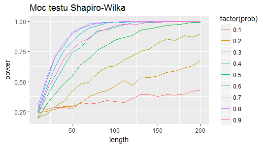

invisible(power_jb %>% ggplot(aes(x = length, 
                        y = power, 
                        col = factor(prob))) +
  geom_line() + ggtitle("Moc testu Jarque-Bera"))
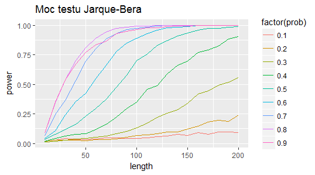

invisible(power_ks %>% ggplot(aes(x = length, 
                        y = power, 
                        col = factor(prob))) +
  geom_line() + ggtitle("Moc testu Ko³mogorowa"))
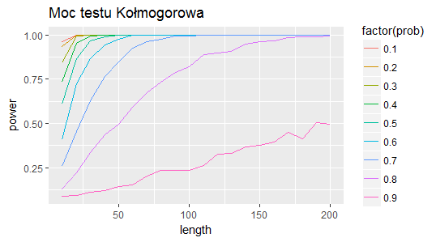

```

**Liczba obserwacji: **Jak widaæ, we wszystkich testach wraz ze wzrostem liczby obserwacji roœnie moc testu. Najsilniej parametr ten oddzia³uje w teœcie Ko³mogorowa, co widaæ po kszta³cie linii prawdopodobieñstwa. Na testy Shapiro-Wilka i Jarque-Bera zwiêkszenie liczby obserwacji wp³ywa dosyæ podobnie.  
**Prawdopodobieñstwo: **Pierwszy rozk³ad mia³ parametry (0,1), natomiast drugi (3,2). W przypadku testów Shapiro-Wilka i Jarque-Bera wzrost prawdopodobieñstwa otrzymania obserwacji z pierwszego rozk³adu prze³o¿y³ siê na wzrost mocy testu. W przypadku testu Ko³mogorowa jest sytuacja odwrotna. Oznaczaj¹c argument "p" funkcji rmix jako prawdopodobieñstwo otrzymania obserwacji z rozk³adu drugiego, otrzymujemy wykres z tak¹ sam¹ zale¿noœci¹ jak w teœcie Shapiro-Wilka i Jarque-Bera.  
Zarówno w testach Shapiro-Wilka i Jarque-Bera, jak i w teœcie Ko³mogorowa, nie sprawdzi³a siê moja hipoteza dotycz¹ca wp³ywu prawdopodobieñstwa na moc testu.  
**Ogólne uwagi: **Test Ko³mogorowa jest najsilniejszym z testów, w przypadku wysokiego "p" wykres startuje z okolic wartoœci 0,5 i szybko pnie siê do góry. Najs³abiej wypad³ test Jarque-Bera, gdzie na osi Y widaæ wartoœæ 0, co œwiadczy o ma³ej pocz¹tkowej mocy (jednak dalej jest podobnie jak w teœcie Shapiro-Wilka).  

## Wp³yw parametrów par_1

# Œrednia par_1

W ka¿dym z poni¿szych przypadków kod wygl¹da tak samo jak w przypadku badania wp³ywu pradopodobieñstwa, z t¹ ró¿nic¹, ¿e inne s¹ parametry. Dla przypadków badaj¹cych wp³yw par_1 oraz par_2 okreœli³em prawdopodobieñstwo p na poziomie 0,6.
```{r}
#############################################################################################
                                           #PAR_1#
#############################################################################################

##########################################  MEAN  ###########################################

set.seed(111)
#iloϾ symulacji
N <- 1

#wartoœci oczekiwane family_1
mean_f1 <- seq(1,10,by=1)
#odchylenia standardowe family_1
sd_f1 <- 2

#wartoœci oczekiwane family_2
mean_f2 <- 0
#odchylenia standardowe family_2
sd_f2 <- 1

#prawdopodobieñstwa wylosowania danych z rozk³adu family_1
prob <- 0.6
#poziom istotnoœci
alpha <- 0.05
#d³ugoœci próby
sample_l <- seq(10,200,by=10)

params <- expand.grid(mean_f1, sd_f1, mean_f2, sd_f2, prob, sample_l)
names(params) <- c("mean_f1", "sd_f1", "mean_f2", "sd_f2", "prob", "length")
```

Obliczam moce wszystkich testów i dodajê je do wczeœniej utworzonej ramki danych.
```{r, results='hide',warning=FALSE}
powers_sw <- sapply(1:nrow(params), function(p){
  mean_f1 <- params[p, 1]
  sd_f1 <- params[p, 2]
  mean_f2 <- params[p, 3]
  sd_f2 <- params[p, 4]
  prob <- params[p, 5]
  l <- params[p, 6]
  p_sim <-sapply(rep(sd_f1, N), function(x){
    rmixx <- rmix(l, "norm", c(mean_f1,sd_f1), "norm", c(mean_f2,sd_f2), prob)
    shapiro.test(rmixx)$p.value
  })
  mean(p_sim < alpha)
})
power_sw <- bind_cols(params, power = powers_sw)

powers_jb <- sapply(1:nrow(params), function(p){
  mean_f1 <- params[p, 1]
  sd_f1 <- params[p, 2]
  mean_f2 <- params[p, 3]
  sd_f2 <- params[p, 4]
  prob <- params[p, 5]
  l <- params[p, 6]
  p_sim <-sapply(rep(sd_f1, N), function(x){
    rmixx <- rmix(l, "norm", c(mean_f1,sd_f1), "norm", c(mean_f2,sd_f2), prob)
    jarque.bera.test(rmixx)$p.value
  })
  mean(p_sim < alpha)
})
power_jb <- bind_cols(params, power = powers_jb)

powers_ks <- sapply(1:nrow(params), function(p){
  mean_f1 <- params[p, 1]
  sd_f1 <- params[p, 2]
  mean_f2 <- params[p, 3]
  sd_f2 <- params[p, 4]
  prob <- params[p, 5]
  l <- params[p, 6]
  p_sim <-sapply(rep(sd_f1, N), function(x){
    rmixx <- rmix(l, "norm", c(mean_f1,sd_f1), "norm", c(mean_f2,sd_f2), prob)
    ks.test(rmixx,pnorm)$p.value
  })
  mean(p_sim < alpha)
})
power_ks <- bind_cols(params, power = powers_ks)
```

Teraz tworzê wykresy dla testów
```{r}
invisible(power_sw %>% ggplot(aes(x = length, 
                        y = power, 
                        col = factor(mean_f1))) +
  geom_line() + ggtitle("Moc testu Shapiro-Wilka"))
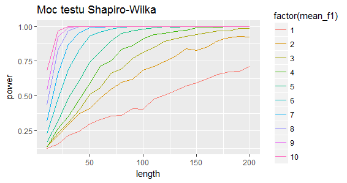

invisible(power_jb %>% ggplot(aes(x = length, 
                        y = power, 
                        col = factor(mean_f1))) +
  geom_line() + ggtitle("Moc testu Jarque-Bera"))
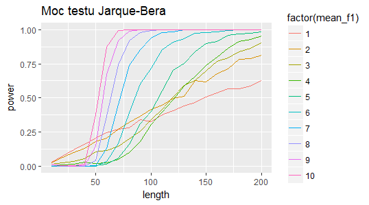

invisible(power_ks %>% ggplot(aes(x = length, 
                        y = power, 
                        col = factor(mean_f1))) +
  geom_line() + ggtitle("Moc testu Ko³mogorowa"))
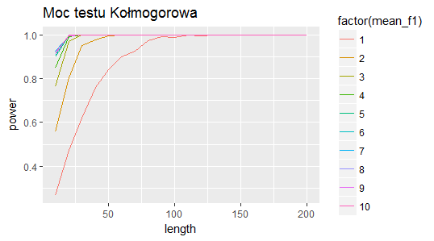

```

**Liczba obserwacji: **Jak widaæ, we wszystkich testach wraz ze wzrostem liczby obserwacji roœnie moc testu. W przypadku testu Ko³mogorowa nag³y wzrost jest widoczny natychmiast, przy ka¿dej wartoœci œredniej. Natomiast przy pozosta³ych testach pocz¹tkowo wygl¹da to na wzrost liniowy, jednak wykresy dla wy¿szych œrednich przypominaj¹ kszta³tem ich odpowiedniki z testu Ko³mogorowa.  
**Œrednia: **W przypadku wszystkich testów wzrost œredniej z pierwszej pary parametrów prze³o¿y³ siê na wzrost mocy testu, nie ma sytuacji jak przy badaniu wp³ywu prawdopodobieñstwa. Na osobn¹ uwagê zas³uguje jednak test Jarque-Bera, któremu towarzyszy pewna anomalia. Przy ma³ej iloœci próby sytuacja nie przypomina tej w innych testach. Wiêksza œrednia wp³ywa wtedy na obni¿enie mocy testu. Sytuacja wraca do normy w okolicy d³ugoœci próby równej 125, kiedy to ma³e wartoœci œredniej z ich liniowym wzrostem (dla œredniej równej 3 wzrost logarytmiczny) zostaj¹ przeœcigniête przez pozosta³e œrednie, z szybszym wzrostem.   
**Ogólne uwagi: **Test Ko³mogorowa okaza³ siê najsilniejszy. Najmniejsza œrednia startuje z poziomu 0,3, a przeskok miêdzy ni¹ a wartoœci¹ drugiej œredniej wynosi a¿ 0,2. Dok³adaj¹c do tego szybki wzrost, nie ulega w¹tpliwoœci, ¿e ten test jest najsilniejszy. Najs³abiej wypad³ test Jarque-Bera, gdzie na osi Y widaæ wartoœæ 0, co œwiadczy o ma³ej pocz¹tkowej mocy. Mimo pocz¹tkowej sporej mocy dla ma³ych œrednich wypada on i tak gorzej w porównaniu z ma³ymi wartoœciami w teœcie Shapiro-Wilka. W przypadku wszystkich wartoœci moc równa jeden jest osi¹gana póŸniej(dla œredniej 10 o d³ugoœæ równ¹ 50, dla œredniej równej 6 a¿ 0 100, ale ju¿ dla œredniej 5 o 75, czyli dla mniejszych œrednich ró¿nica jest mniejsza). Oba testy jednak i tak pozostawia w tyle test Ko³mogorowa.  

# Odchylenie standardowe par_1

Rozwa¿ê teraz wp³yw odchylenia standardowego par_1.
```{r}
##########################################  SD  #############################################

set.seed(111)
#iloϾ symulacji
N <- 1

#wartoœci oczekiwane family_1
mean_f1 <- 5
#odchylenia standardowe family_1
sd_f1 <- seq(1,10,by=1)

#wartoœci oczekiwane family_2
mean_f2 <- 0
#odchylenia standardowe family_2
sd_f2 <- 1

#prawdopodobieñstwa wylosowania danych z rozk³adu family_1
prob <- 0.6
#poziom istotnoœci
alpha <- 0.05
#d³ugoœci próby
sample_l <- seq(10,200,by=10)

params <- expand.grid(mean_f1, sd_f1, mean_f2, sd_f2, prob, sample_l)
names(params) <- c("mean_f1", "sd_f1", "mean_f2", "sd_f2", "prob", "length")
```

Nastêpnie obliczam moce wszystkich testów i dodajê je do wczeœniej utworzonej ramki danych.
```{r, results='hide',warning=FALSE}
powers_sw <- sapply(1:nrow(params), function(p){
  mean_f1 <- params[p, 1]
  sd_f1 <- params[p, 2]
  mean_f2 <- params[p, 3]
  sd_f2 <- params[p, 4]
  prob <- params[p, 5]
  l <- params[p, 6]
  p_sim <-sapply(rep(sd_f1, N), function(x){
    rmixx <- rmix(l, "norm", c(mean_f1,sd_f1), "norm", c(mean_f2,sd_f2), prob)
    shapiro.test(rmixx)$p.value
  })
  mean(p_sim < alpha)
})
power_sw <- bind_cols(params, power = powers_sw)

powers_jb <- sapply(1:nrow(params), function(p){
  mean_f1 <- params[p, 1]
  sd_f1 <- params[p, 2]
  mean_f2 <- params[p, 3]
  sd_f2 <- params[p, 4]
  prob <- params[p, 5]
  l <- params[p, 6]
  p_sim <-sapply(rep(sd_f1, N), function(x){
    rmixx <- rmix(l, "norm", c(mean_f1,sd_f1), "norm", c(mean_f2,sd_f2), prob)
    jarque.bera.test(rmixx)$p.value
  })
  mean(p_sim < alpha)
})
power_jb <- bind_cols(params, power = powers_jb)

powers_ks <- sapply(1:nrow(params), function(p){
  mean_f1 <- params[p, 1]
  sd_f1 <- params[p, 2]
  mean_f2 <- params[p, 3]
  sd_f2 <- params[p, 4]
  prob <- params[p, 5]
  l <- params[p, 6]
  p_sim <-sapply(rep(sd_f1, N), function(x){
    rmixx <- rmix(l, "norm", c(mean_f1,sd_f1), "norm", c(mean_f2,sd_f2), prob)
    ks.test(rmixx,pnorm)$p.value
  })
  mean(p_sim < alpha)
})
power_jb <- bind_cols(params, power = powers_ks)
```

Teraz tworzê wykresy dla testów
```{r}
invisible(power_sw %>% ggplot(aes(x = length, 
                        y = power, 
                        col = factor(sd_f1))) +
  geom_line() + ggtitle("Moc testu Shapiro-Wilka"))
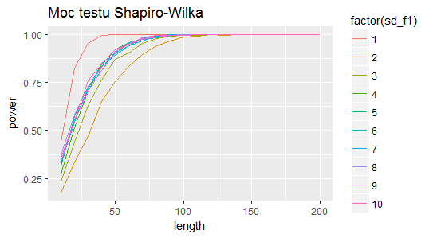

invisible(power_jb %>% ggplot(aes(x = length, 
                        y = power, 
                        col = factor(sd_f1))) +
  geom_line() + ggtitle("Moc testu Jarque-Bera"))
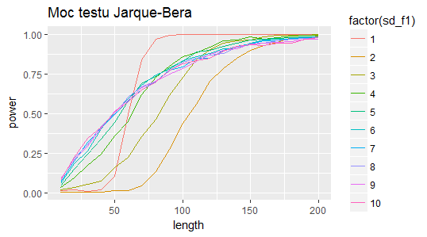

invisible(power_ks %>% ggplot(aes(x = length, 
                        y = power, 
                        col = factor(sd_f1))) +
  geom_line() + ggtitle("Moc testu Ko³mogorowa"))
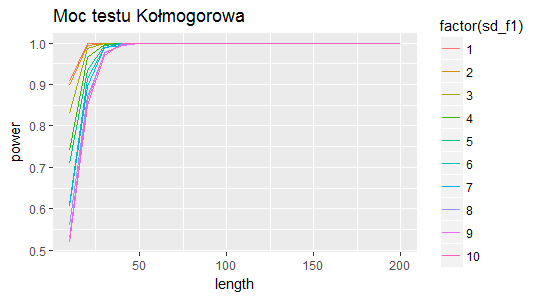

```

**Liczba obserwacji: **Jak widaæ, we wszystkich testach wraz ze wzrostem liczby obserwacji roœnie moc testu. W ka¿dym z testów wzrost ten wygl¹da podobnie (w teœcie Ko³mogorowa linia jest znacznie bardziej pionowa), z wyj¹tkiem ma³ych wartoœci odchyleñ w teœcie Jarque-Bera, gdzie wygl¹da to podobnie jak przy œredniej (dla ma³ych odchyleñ niewielki wzrost liczby obserwacji znacz¹co wp³ywa na moc testu).  
**Odchylenie standardowe: **Sytuacja wygl¹da najproœciej w teœcie Ko³mogorowa. Wzrost odchylenia standardowego przek³ada siê na spadek mocy testu, jednak ju¿ w próbce równej oko³o 40 przez wszystkie odchylenia zostaje osi¹gniêta moc równa jeden. W przypadku tego testu nie potwierdzi³a siê moja hipoteza. Mo¿na natomiast powiedzieæ, ¿e trafnie przewidzia³em wynik w przypadku dwóch pozosta³ych testów, choæ nie do koñca. Na pocz¹tku (do odchylenia równego 2) moc testu spada, a by potem wzrosn¹æ, a powy¿ej liczby 4-5 nie widaæ wiêkszych ró¿nic (przy odchyleniu równym jeden najszybciej zostaje osi¹gniêta moc równa jeden: w Shapiro-Wilka dla 40 obserwacji, w Jarque-Bera dla 90, w obu sporo szybciej ni¿ dla pozosta³ych odchyleñ, zw³aszcza przy teœcie Jarque-Bera). Oznacza to, ¿e dla wykresów "szczup³ych", z ma³ym odchyleniem, moc testu jest najwiêksza (w teœcie Jarque-Bera widaæ to dopiero powy¿ej 60 obserwacji), a na kolejnym miejscu plasuj¹ siê rozk³ady z odchyleniem doœæ sporym (przy za³o¿onych wy¿ej danych, gdzie wartoœci œrednie s¹ od siebie oddalone).  
**Ogólne uwagi: **Tym razem test Ko³mogorowa równie¿ okaza³ siê najsilniejszy. Cechuje go tak¿e odstêpstwo od pozosta³ych testów pod wzglêdem wyników, gdy¿ coraz wy¿sze wartoœci odchyleñ powoduj¹ spadek, a nie wzrost mocy testu. Najs³abiej ponownie wypad³ test Jarque-Bera, gdzie na osi Y widaæ wartoœæ 0, co œwiadczy o ma³ej pocz¹tkowej mocy. PóŸniej te¿ nie jest lepiej - kiedy test Shapiro-Wilka osi¹ga przy d³ugoœci równej 125 moc równ¹ jeden dla wszystkich odchyleñ, test Jarque-Bera ma tak¹ sytuacjê tylko w przypadku jedynki.  

## Wp³yw parametrów par_2

# Œrednia par_2

Dane z drugiego rozk³adu s¹ brane z prawdopodobieñstwem równym 40%, wiêc mo¿na oczekiwaæ niewielkich ró¿nic w porównaniu z badaniem wp³ywu parametrów par_1.
```{r}
#############################################################################################
                                           #PAR_2#
#############################################################################################

##########################################  MEAN  ###########################################

set.seed(111)
#iloϾ symulacji
N <- 1

#wartoœci oczekiwane family_1
mean_f1 <- 0
#odchylenia standardowe family_1
sd_f1 <- 1

#wartoœci oczekiwane family_2
mean_f2 <- seq(1,10,by=1)
#odchylenia standardowe family_2
sd_f2 <- 2

#prawdopodobieñstwa wylosowania danych z rozk³adu family_1
prob <- 0.6
#poziom istotnoœci
alpha <- 0.05
#d³ugoœci próby
sample_l <- seq(10,200,by=10)

params <- expand.grid(mean_f1, sd_f1, mean_f2, sd_f2, prob, sample_l)
names(params) <- c("mean_f1", "sd_f1", "mean_f2", "sd_f2", "prob", "length")
```

Nastêpnie obliczam moce testów i dodajê je do wczeœniej utworzonej ramki danych.
```{r, results='hide',warning=FALSE}
powers_sw <- sapply(1:nrow(params), function(p){
  mean_f1 <- params[p, 1]
  sd_f1 <- params[p, 2]
  mean_f2 <- params[p, 3]
  sd_f2 <- params[p, 4]
  prob <- params[p, 5]
  l <- params[p, 6]
  p_sim <-sapply(rep(sd_f1, N), function(x){
    rmixx <- rmix(l, "norm", c(mean_f1,sd_f1), "norm", c(mean_f2,sd_f2), prob)
    shapiro.test(rmixx)$p.value
  })
  mean(p_sim < alpha)
})
power_sw <- bind_cols(params, power = powers_sw)

powers_jb <- sapply(1:nrow(params), function(p){
  mean_f1 <- params[p, 1]
  sd_f1 <- params[p, 2]
  mean_f2 <- params[p, 3]
  sd_f2 <- params[p, 4]
  prob <- params[p, 5]
  l <- params[p, 6]
  p_sim <-sapply(rep(sd_f1, N), function(x){
    rmixx <- rmix(l, "norm", c(mean_f1,sd_f1), "norm", c(mean_f2,sd_f2), prob)
    jarque.bera.test(rmixx)$p.value
  })
  mean(p_sim < alpha)
})
power_jb <- bind_cols(params, power = powers_jb)

powers_ks <- sapply(1:nrow(params), function(p){
  mean_f1 <- params[p, 1]
  sd_f1 <- params[p, 2]
  mean_f2 <- params[p, 3]
  sd_f2 <- params[p, 4]
  prob <- params[p, 5]
  l <- params[p, 6]
  p_sim <-sapply(rep(sd_f1, N), function(x){
    rmixx <- rmix(l, "norm", c(mean_f1,sd_f1), "norm", c(mean_f2,sd_f2), prob)
    ks.test(rmixx,pnorm)$p.value
  })
  mean(p_sim < alpha)
})
power_ks <- bind_cols(params, power = powers_ks)
```

Teraz tworzê wykresy dla testów.
```{r}
invisible(power_sw %>% ggplot(aes(x = length, 
                        y = power, 
                        col = factor(mean_f2))) +
  geom_line() + ggtitle("Moc testu Shapiro-Wilka"))
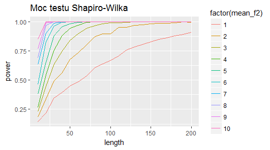

invisible(power_jb %>% ggplot(aes(x = length, 
                        y = power, 
                        col = factor(mean_f2))) +
  geom_line() + ggtitle("Moc testu Jarque-Bera"))
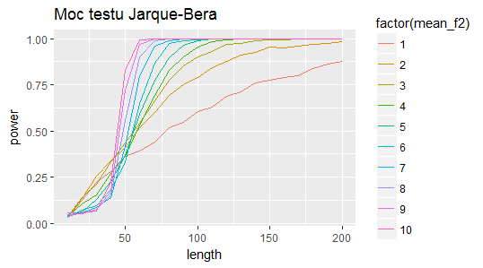

invisible(power_ks %>% ggplot(aes(x = length, 
                        y = power, 
                        col = factor(mean_f2))) +
  geom_line() + ggtitle("Moc testu Ko³mogorowa"))
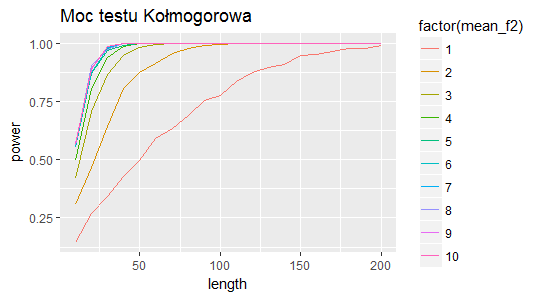

```

**Liczba obserwacji: **Sytuacja jest podobna do œredniej z par_1, we wszystkich testach wraz ze wzrostem liczby obserwacji roœnie moc testu. Najwiêkszy wp³yw liczba obserwacji ma przy wiêkszych œrednich, gdzie wyd³u¿enie próbki o ma³¹ iloœæ wp³ywa znacz¹co na podwy¿szenie mocy testu. Dla coraz wy¿szych œrednich wp³yw jest ten coraz bardziej widoczny. Wyj¹tek stanowi test Ko³mogorowa, gdzie od œredniej równej 5 nie widaæ ró¿nicy w nachyleniu linii. Warto wyró¿niæ te¿ test Jarque-Bera, gdzie, jak przy œredniej z par_1, zmiana d³ugoœci próby wp³ywa szczególnie mocno na moc próby w doœæ w¹skim przedziale. Zwiêkszenie obserwacji z 40 do 75 podnosi moc testu o przynajmniej 0.5 (licz¹c od œredniej równej 4, choæ te ni¿sze, poza jedynk¹, te¿ sporo przyœpieszaj¹).  
**Œrednia: **W przypadku wszystkich testów wzrost œredniej z drugiej pary parametrów prze³o¿y³ siê na wzrost mocy testu, podobnie jak w par_1. Ponownie wystêpuje pewna anomalia przy teœcie Jarque-Bera. Przy ma³ej iloœci próby sytuacja nie przypomina tej w innych testach. Wiêksza œrednia wp³ywa wtedy na obni¿enie mocy testu. Sytuacja wraca do normy w okolicy d³ugoœci próby równej 50, kiedy to ma³e wartoœci œredniej z ich wolniejszym wzrostem zostaj¹ przeœcigniête przez pozosta³e œrednie, z szybszym wzrostem.     
**Ogólne uwagi: **Test Ko³mogorowa i w tej parze parametrów okaza³ siê najsilniejszy - dosyæ spory przeskok miêdzy najmniejsz¹ œredni¹ a wartoœci¹ tej drugiej œredniej (oko³o 0,15) i szybki wzrost. Najs³abiej wypad³ test Jarque-Bera, gdzie na osi Y widaæ wartoœæ 0, co œwiadczy o ma³ej pocz¹tkowej mocy. Mimo pocz¹tkowej sporej mocy dla ma³ych œrednich wypada on i tak gorzej w porównaniu z ma³ymi wartoœciami w teœcie Shapiro-Wilka. W przypadku wszystkich wartoœci moc równa jeden jest osi¹gana póŸniej(dla œredniej 10 o d³ugoœæ równ¹ 40, dla œredniej równej 6 a¿ o 55, ale ju¿ dla œredniej 5 o 40, czyli dla mniejszych œrednich ró¿nica jest mniejsza). Oba testy jednak i tak pozostawia w tyle test Ko³mogorowa.  

# Odchylenie standardowe par_2

Rozwa¿ê teraz wp³yw odchylenia standardowego par_2.
```{r}
##########################################  SD  #############################################

set.seed(111)
#iloϾ symulacji
N <- 1

#wartoœci oczekiwane family_1
mean_f1 <- 0
#odchylenia standardowe family_1
sd_f1 <- 1

#wartoœci oczekiwane family_2
mean_f2 <- 5
#odchylenia standardowe family_2
sd_f2 <- seq(1,10,by=1)

#prawdopodobieñstwa wylosowania danych z rozk³adu family_1
prob <- 0.6
#poziom istotnoœci
alpha <- 0.05
#d³ugoœci próby
sample_l <- seq(10,200,by=10)

params <- expand.grid(mean_f1, sd_f1, mean_f2, sd_f2, prob, sample_l)
names(params) <- c("mean_f1", "sd_f1", "mean_f2", "sd_f2", "prob", "length")
```

Nastêpnie obliczam moce testów i dodajê je do wczeœniej utworzonej ramki danych.
```{r, results='hide',warning=FALSE}
powers_sw <- sapply(1:nrow(params), function(p){
  mean_f1 <- params[p, 1]
  sd_f1 <- params[p, 2]
  mean_f2 <- params[p, 3]
  sd_f2 <- params[p, 4]
  prob <- params[p, 5]
  l <- params[p, 6]
  p_sim <-sapply(rep(sd_f1, N), function(x){
    rmixx <- rmix(l, "norm", c(mean_f1,sd_f1), "norm", c(mean_f2,sd_f2), prob)
    shapiro.test(rmixx)$p.value
  })
  mean(p_sim < alpha)
})
power_sw <- bind_cols(params, power = powers_sw)

powers_jb <- sapply(1:nrow(params), function(p){
  mean_f1 <- params[p, 1]
  sd_f1 <- params[p, 2]
  mean_f2 <- params[p, 3]
  sd_f2 <- params[p, 4]
  prob <- params[p, 5]
  l <- params[p, 6]
  p_sim <-sapply(rep(sd_f1, N), function(x){
    rmixx <- rmix(l, "norm", c(mean_f1,sd_f1), "norm", c(mean_f2,sd_f2), prob)
    jarque.bera.test(rmixx)$p.value
  })
  mean(p_sim < alpha)
})
power_jb <- bind_cols(params, power = powers_jb)

powers_ks <- sapply(1:nrow(params), function(p){
  mean_f1 <- params[p, 1]
  sd_f1 <- params[p, 2]
  mean_f2 <- params[p, 3]
  sd_f2 <- params[p, 4]
  prob <- params[p, 5]
  l <- params[p, 6]
  p_sim <-sapply(rep(sd_f1, N), function(x){
    rmixx <- rmix(l, "norm", c(mean_f1,sd_f1), "norm", c(mean_f2,sd_f2), prob)
    ks.test(rmixx,pnorm)$p.value
  })
  mean(p_sim < alpha)
})
power_ks <- bind_cols(params, power = powers_ks)
```

Teraz tworzê wykresy dla testów.
```{r}
invisible(power_sw %>% ggplot(aes(x = length, 
                        y = power, 
                        col = factor(sd_f2))) +
  geom_line() + ggtitle("Moc testu Shapiro-Wilka"))
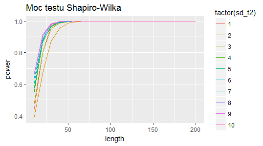

invisible(power_jb %>% ggplot(aes(x = length, 
                        y = power, 
                        col = factor(sd_f2))) +
  geom_line() + ggtitle("Moc testu Jarque-Bera"))
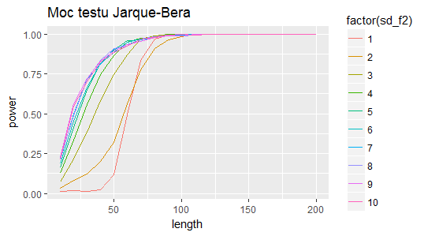

invisible(power_ks %>% ggplot(aes(x = length, 
                        y = power, 
                        col = factor(sd_f2))) +
  geom_line() + ggtitle("Moc testu Ko³mogorowa"))
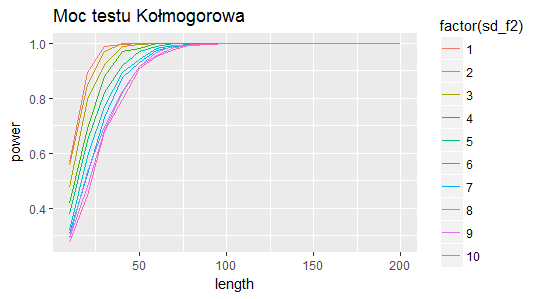

```

**Liczba obserwacji: **We wszystkich testach wraz ze wzrostem liczby obserwacji roœnie moc testu. Tym razem d³ugoœæ próby ma najwiêkszy wp³yw w teœcie Shapiro-Wilka, gdzie wykresy s¹ najbardziej zbli¿one do pionu.  
**Odchylenie standardowe: **Sytuacja wygl¹da najproœciej w teœcie Ko³mogorowa. Wzrost odchylenia standardowego przek³ada siê na spadek mocy testu, jednak ju¿ w próbce równej oko³o 100 przez wszystkie odchylenia zostaje osi¹gniêta moc równa jeden. W przypadku tego testu nie potwierdzi³a siê moja hipoteza, ale trafnie przewidzia³em wynik w przypadku dwóch pozosta³ych testów, choæ nie do koñca. W teœcie Shapiro-Wilka na pocz¹tku (do odchylenia równego 2) moc testu spada, aby potem wzrosn¹æ. W teœcie Jarque-Bera od liczby obserwacji równej 50 zmienia siê nieco uk³ad odchyleñ standardowych. Zaczyna gwa³townie rosn¹æ moc dla odchylenia równego 1 (przy liczbie obserwacji równej 70 przegania odchylenie równe 2, aby nastêpnie osi¹gn¹æ moc równ¹ 1 przed niektórymi wy¿szymi odchyleniami), a odchylenia 4 i 5 (trochê póŸniej tak¿e 3) wysuwaj¹ siê na prowadzenie, aby potem zrównaæ siê z reszt¹ wysokich odchyleñ. Jeœli chodzi o poszczególne odchylenia, powy¿ej liczby 4 (test Shapiro-Wilka), 8 (test Jarque-Bera) nie widaæ wiêkszych ró¿nic, czyli zwiêkszenie odchylenia nie przek³ada siê na wzrost mocy testu. Natomiast wykresy szczup³e, z ma³ym odchyleniem, s¹ szczególnie mocne w wybranych przedzia³ach (50-70, dla odchylenia równego 4-5, to dotyczy jednak wy³¹cznie testu Jarque-Bera).  
**Ogólne uwagi: **Tym razem test Ko³mogorowa nie okaza³ siê najsilniejszy. Jego pozycjê zaj¹³ test Shapiro-Wilka, który razem z testem Jarque-Bera potwierdza moj¹ hipotezê. Nie zmieni³o siê ostatnie miejsce na podium - najs³abiej ponownie wypad³ test Jarque-Bera, gdzie na osi Y widaæ wartoœæ 0, co œwiadczy o ma³ej pocz¹tkowej mocy. PóŸniej te¿ nie jest lepiej, mimo podobnej dynamiki w porównaniu z pozosta³ymi testami.  

### Zakoñczenie (czêœæ I)

**Œrednia par_1 a œrednia par_2: **  
*Testy Shapiro-Wilka oraz Jarque-Bera dla par_2*:   
-Wykresy s¹ "œciœniête", co oznacza, ¿e testy dla œredniej par_2 bardziej reaguj¹ na zwiêkszenie d³ugoœci próby, szybciej osi¹ga siê wiêksz¹ moc testu ni¿ przy par_1 dla takich samych œrednich   
*Test Ko³mogorowa dla par_2*:  
-Sytuacja odwrotna, wykres przesun¹³ siê w prawo wzglêdem par_1, mniejsza moc testu  
*Wniosek*: ¯eby zwiêkszyæ moc testu przy jak najmniejszej dodanej liczbie obserwacji, nale¿y dodawaæ obserwacje z rozk³adu drugiego (1-p, gdy p>0,5) (w przypadku testów Shapiro-Wilka i Jarque-Bera, w teœcie Ko³mogorowa trzeba post¹piæ odwrotnie).  

**Odchylenie standardowe par_1 a odchylenie standardowe par_2: **  
*Testy Shapiro-Wilka oraz Jarque-Bera dla par_2*:   
-Wykresy s¹ "œciœniête", co oznacza, ¿e testy dla odchylenia par_2 bardziej reaguj¹ na zwiêkszenie d³ugoœci próby, szybciej osi¹ga siê wiêksz¹ moc testu ni¿ przy par_1 dla takich samych œrednich  
-Zniknê³a dominuj¹ca pozycja odchylenia równego jeden: w teœcie Shapiro-Wilka linia przesunê³a siê w dó³, a reszta powêdrowa³a do góry; w teœcie Jarque-Bera linia pozosta³a na miejscu, ale reszta powêdrowa³a do góry  
-W teœcie Jarque-Bera s³abnie pozycja mniejszych odchyleñ standardowych, przeœcigaj¹ one te wy¿sze na przedziale 50-75, a nie na przedziale 70-200+. 
*Test Ko³mogorowa dla par_2*:  
-Wykres przesun¹³ siê w prawo wzglêdem par_1, mniejsza moc testu  
*Wnioski*:  
Optymalnym rozwi¹zaniem jest utrzymanie odchylenia standardowego par_1 na poziomie 1, co prze³o¿y siê na wysok¹ moc testów Shapiro-Wilka i Ko³mogorowa, a od liczby obserwacji równej 60 tak¿e Jarque-Bera. Utrzymanie niskiego odchylenia (2-5) pozwoli uzyskaæ mniejsz¹, ale doœæ wysok¹ moc dla testów Ko³mogorowa oraz Jarque-Bera (od 80-120 obserwacji). Z kolei du¿e odchylenia bêd¹ drug¹ opcj¹ dla testu Shapiro-Wilka oraz najlepszym rozwi¹zaniem dla ma³ej próby w teœcie Jarque-Bera (w du¿ych próbach wygl¹da to niewiele gorzej).  
W par_2 zdecydowanie trzymanie siê niskich odchyleñ ( w tym jedynki) nie op³aca siê tak, jak w par_1. Mo¿na wybraæ albo wysokie odchylenia (du¿a moc w testach Shapiro-Wilka i Jarque-Bera, ale ma³a w teœcie Ko³mogorowa), albo te œrednie (wszêdzie œrednia moc testu).  

### Mieszanka dwóch rozk³adów Poissona

## Wprowadzenie (czêœæ II)

Celem tej czêœci jest sprawdzenie mocy testu Wilcoxona dla mieszanki dwóch rozk³adów Poissona.  
**Hipoteza**: Nie ma w¹tpliwoœci, ¿e wraz ze wzrostem liczby obserwacji moc testu bêdzie rosn¹æ. Wiêksza liczba obserwacji pozwala na dostrze¿enie nieœcis³oœci w pocz¹tkowo dobrze wygl¹daj¹cym modelu. W czêœci I wraz ze wzrostem "p" moc testu ros³a (test Shapiro-Wilka i Jarque-Bera) albo mala³a (test Ko³mogorowa). Co do Wilcoxona, bêdzie to na pewno jedna z tych dwóch opcji, mimo, ¿e intuicja podpowiada mi rozwi¹zanie z mojej hipotezy. Jeœli chodzi o par_2, myœlê, ¿e im bêdzie ono bli¿ej (obojêtnie, z której strony) par_1, tym wiêksza bêdzie moc testu.  
**Dane**: Rozwa¿am dane o d³ugoœci od 10 do 200. Liczbê symulacji ustawi³em na 10. W skrypcie u¿ywa³em liczby 1000, ale gdy przysz³o do kompilowania wszystkiego naraz, mój komputer nie da³ rady. Aby jednak lepiej zobrazowaæ zale¿noœci, nie bêdê wyœwietla³ wykresów utworzonych na podstawie widocznego poni¿ej kodu, lecz wstawiê obrazy przygotowane jeden po drugim w skrypcie, z liczb¹ symulacji równ¹ tysi¹c.

## Wp³yw prawdopodobieñstwa

Na pocz¹tku wprowadzê wybrane przeze mnie parametry rozk³adów Poissona oraz stworzê ramkê danych dla kombinacji tych w³aœnie parametrów, poziomu istotnoœci i d³ugoœci danych.
```{r}
#############################################################################################
                                    #PRAWDOBODOBIEÑSTWO#
#############################################################################################

set.seed(111)
#iloϾ symulacji
N <- 1

#lambda family_1
lambda_f1 <- 2

#lambda family_2
lambda_f2 <- 5

#prawdopodobieñstwa wylosowania danych z rozk³adu family_1
prob <- seq(0.1,0.9, by=.1)
#poziom istotnoœci
alpha <- 0.05
#d³ugoœci próby
sample_l <- seq(10,200,by=10)

params <- expand.grid(lambda_f1, lambda_f2, prob, sample_l)
names(params) <- c("lambda_f1", "lambda_f2", "prob", "length")
```

Nastêpnie obliczam moc testu Wilcoxona i dodajê j¹ do wczeœniej utworzonej ramki danych.
```{r, results='hide', warning=FALSE}
powers_w <- sapply(1:nrow(params), function(p){
  lambda_f1 <- params[p, 1]
  lambda_f2 <- params[p, 2]
  prob <- params[p, 3]
  l <- params[p, 4]
  p_sim <-sapply(rep(lambda_f1, N), function(x){
    rmixx <- rmix(l, "poiss", lambda_f1, "poiss", lambda_f2, prob)
    wilcox.test(rmixx, rpois(l,lambda_f1), exact = FALSE)$p.value
 })
 mean(p_sim < alpha)
})
power_w <- bind_cols(params, power = powers_w)
```

Teraz tworzê wykres dla testu.
```{r}
invisible(power_w %>% ggplot(aes(x = length, 
                        y = power, 
                        col = factor(prob))) +
  geom_line() + ggtitle("Moc testu Wilcoxona"))
knitr::include_graphics("Wilcoxon_p.png")
```

**Liczba obserwacji: **Wraz ze wzrostem liczby obserwacji roœnie moc testu. Sprawdzi³a siê moja hipoteza.  
**Prawdopodobieñstwo: **Test Wilcoxona powtórzy³ rozwi¹zanie testu Ko³mogorowa dla prawdopodobieñstwa. Moc testu spada, pocz¹tkowo nieznacznie, ale wraz ze wzrostem prawdopodobieñstwa ten spadek przyœpiesza.  
**Ogólne uwagi: **Spadek mocy w teœcie Wilcoxona jest bardziej dynamiczny wzglêdem spadku w teœcie Ko³mogorowa, nastêpuje to szybciej, lecz wp³yw liczby obserwacji jest podobny.

## Wp³yw parametru par_2
Rozwa¿ê teraz wp³yw parametru par_2, czyli lambdy. Prawdopodobieñstwo ustawi³em na 0,5.
```{r}
#############################################################################################
                                            #PAR_2#
#############################################################################################

set.seed(111)
#iloϾ symulacji
N <- 1

#lambda family_1
lambda_f1 <- 5

#lambda family_2
lambda_f2 <- seq(1,10)

#prawdopodobieñstwa wylosowania danych z rozk³adu family_1
prob <- 0.5
#poziom istotnoœci
alpha <- 0.05
#d³ugoœci próby
sample_l <- seq(10,200,by=10)

params <- expand.grid(lambda_f1, lambda_f2, prob, sample_l)
names(params) <- c("lambda_f1", "lambda_f2", "prob", "length")
```

Obliczam moc testu Wilcoxona i dodajê j¹ do wczeœniej utworzonej ramki danych.
```{r, results='hide', warning=FALSE}
powers_w <- sapply(1:nrow(params), function(p){
  lambda_f1 <- params[p, 1]
  lambda_f2 <- params[p, 2]
  prob <- params[p, 3]
  l <- params[p, 4]
  p_sim <-sapply(rep(lambda_f1, N), function(x){
    rmixx <- rmix(l, "poiss", lambda_f1, "poiss", lambda_f2, prob)
    wilcox.test(rmixx, rpois(l,lambda_f1), exact = FALSE)$p.value
 })
 mean(p_sim < alpha)
})
power_w <- bind_cols(params, power = powers_w)
```

Teraz tworzê wykres dla testu.
```{r}
invisible(power_w %>% ggplot(aes(x = length, 
                        y = power, 
                        col = factor(lambda_f2))) +
  geom_line() + ggtitle("Moc testu Wilcoxona"))
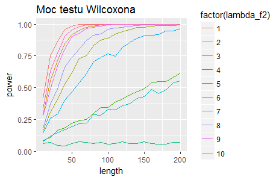
```

**Liczba obserwacji: **Ponownie nie ulega w¹tpliwoœci, ¿e wraz ze wzrostem d³ugoœci próby roœnie moc testu, chocia¿ wyj¹tek stanowi par_2 = 5, gdzie moc ca³y czas oscyluje wokó³ zera.  
**Prawdopodobieñstwo: **Jak to zosta³o ju¿ zaakcentowane przy liczbie obserwacji, w sytuacji, gdy par_1 = par_2, moc testu wynosi trochê wiêcej ni¿ 0.  Im wiêksza jest ró¿nica miêdzy par_1 a par_2, tym wiêksza jest moc testu. Linie jednak nie nachodz¹ na siebie. Kiedy mamy do czynienia z wartoœciami le¿¹cymi w równej odleg³oœci od par_2, ale jedna jest mniejsza, a druga wiêksza, test dla tej mniejszej ma wiêksz¹ moc.  
**Ogólne uwagi: **Naj³atwiej jest zauwa¿yæ fakt istnienia dwóch rozk³adów wtedy, gdy wartoœæ par_2 jest bardziej oddalona od par_1 i jest od niej mniejsza.  

## Zakoñczenie (czêœæ II)
Potwierdzi³y siê moje hipotezy dotycz¹ce wp³ywu prawdopodobieñstwa, parametru par_2 oraz d³ugoœæi próby na moc testu Wilcoxona. Nie okreœli³em jednak dok³adnie, jak zachowa siê test, gdy "p" bêdzie zwiêkszane - by³by to totalny strza³, przy wybieraniu jednej z dwóch wskazanych mo¿liwoœci. Test ten ró¿ni³ siê od testów z czêœci pierwszej tym, ¿e wprowadzi³em nachodzenie na siebie parametrów, czego nie uwzglêdni³em w czêœci pierwszej.
